# Project Report


## Administrative information

### Team

Last name, first name | Github id   | Main role in the project part 1
----------------------|-------------|-------------------------
Berney Léonard        | D3410CK     | Database
Bron Sacha            | BinaryBrain | Views
Villa David           | yoaaaarp    | Controller
Pellet Marc           | Marcpellet  | Controller

Last name, first name | Github id   | Main role in the project part 2
----------------------|-------------|-------------------------
Berney Léonard        | D3410CK     | REST-API
Bron Sacha            | BinaryBrain | Demo App
Villa David           | yoaaaarp    | REST-API
Pellet Marc           | Marcpellet  | Bugs fix part 1 & SQL queries

### Tasks realized by the different team members
Bugs fix part 1.  
Definition and implementation of the Gamification's features (badge, point, level, reputation, event).  
Implementation of a demo application.  


## Introduction

This is a group project for the AMT course of HEIG-VD. The goal is to developp a website using JavaEE on a glassfish server. The website have a list of users who can submit applications. In the project, we will design and build a generic gamification platform. In other words, we will create a service that will be used by other developers.

###Part 1
In the first part of the project, we will apply techniques presented in the course to build the foundation of the gamification platform. We will implement a simple domain model to deal with user accounts, roles, applications and API keys. We will also implement a web UI to manage these elements. An automated test procedure will also be written.

###Part 2
In the second part of the project, we will deploy the REST-API used by the gamification platform. This platform will provide three types of gamification : Badges, Points and Levels. An application's admin will be able to create, update and delete his own badges/levels and will be able to trigger existing rules by sending events to the REST-API. 
We will also implement a demo application which will use this API to create ressources and interact throughout events. 

## User Guide

### How to execute and access the application

- Make sure MySQL is started and configured properly
- Same for Glassfish server
- In Netbeans, simply run the project

### How to use the application

- Once the application is deployed, if using the default config, you should be able to access it through [http://localhost:8080/AMTProject](http://localhost:8080/AMTProject)

### How to update, build and deploy the application

- Start by cloning th repository localy
- In MySQL, create a database named "AMTdatabase"
- then create a user named "AMTUser" with password "amtpassword", give this user admin privileges on the previously created database
- Compiling and deploying the application is done in Netbeans. Just load the project and hit the "play" button.

### How to run the automated test procedure

No automatic testing has been done yet.

## Design

### System overview
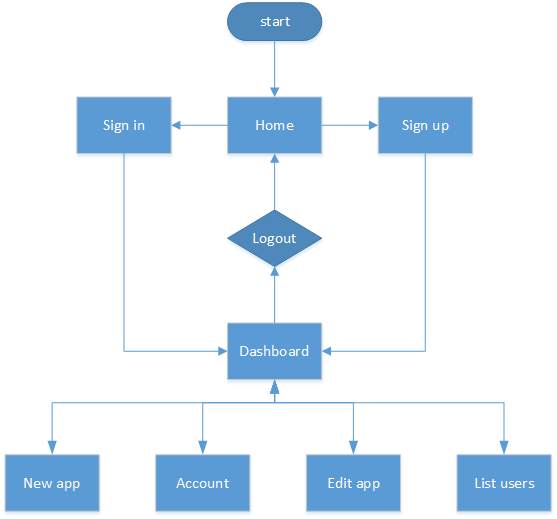

### Domain Model
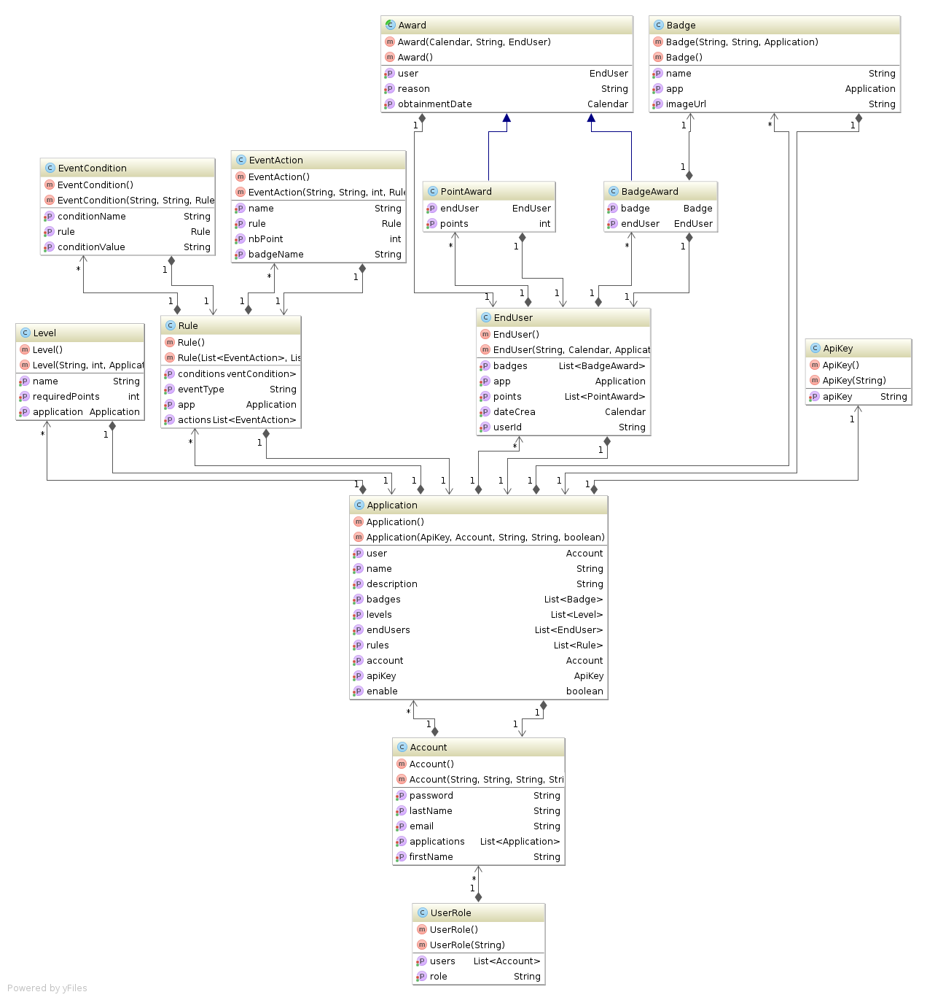

### Gamification features
The end user can earn :
 - Badges
 - Points
 - Levels (automatically, according to the total points)

End user stats can be retrieved through the reputation API.
 
The application's admin can create for his application :
 - Badges
 - Levels

We've followed the approach just below to implement the REST API :
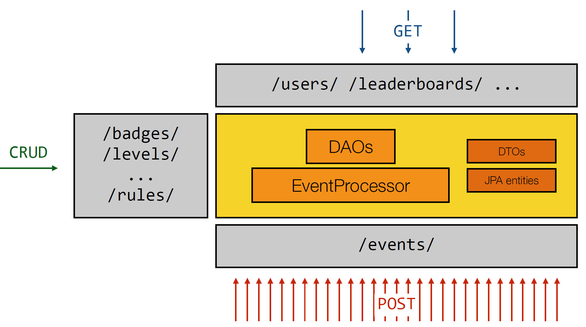

The Gamification's entities are :
 - Level
 - Badge
 - Rule
 - EventCondition
 - EventAction
 - Award
 - BadgeAward
 - PointAward

You can find them into the global [models domain](#domain-model) schema.

### User interface
Home & Login
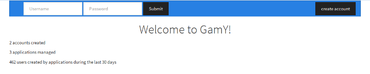

Home & Login fail
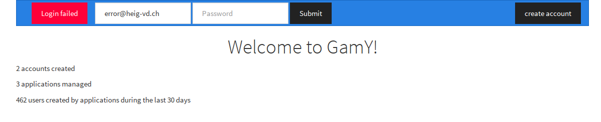

Registration
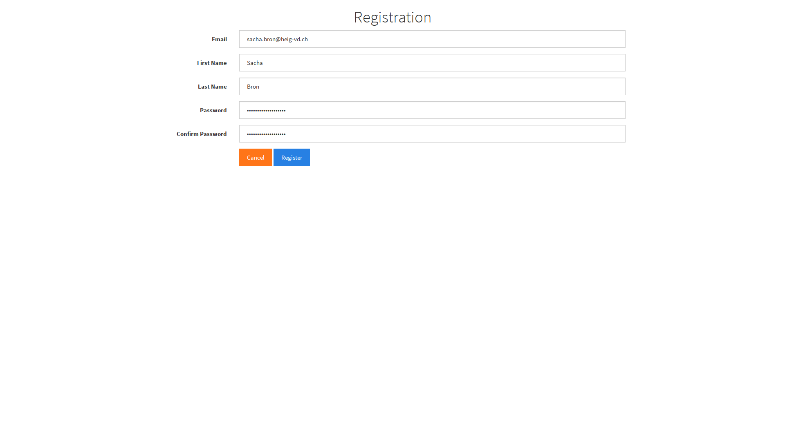

Dashboard
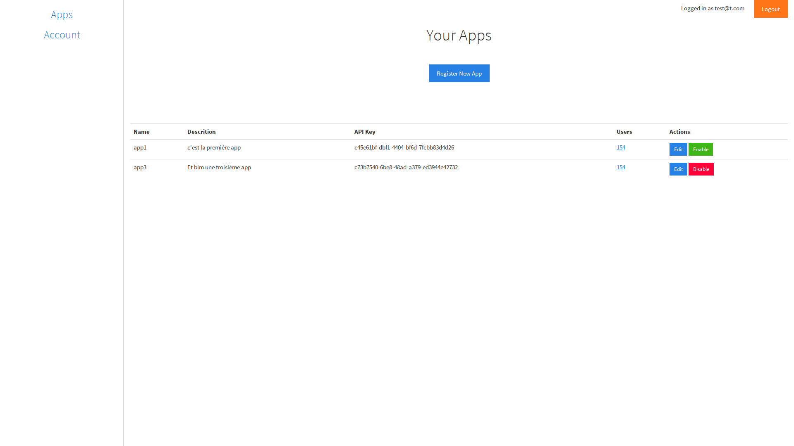

Edit account
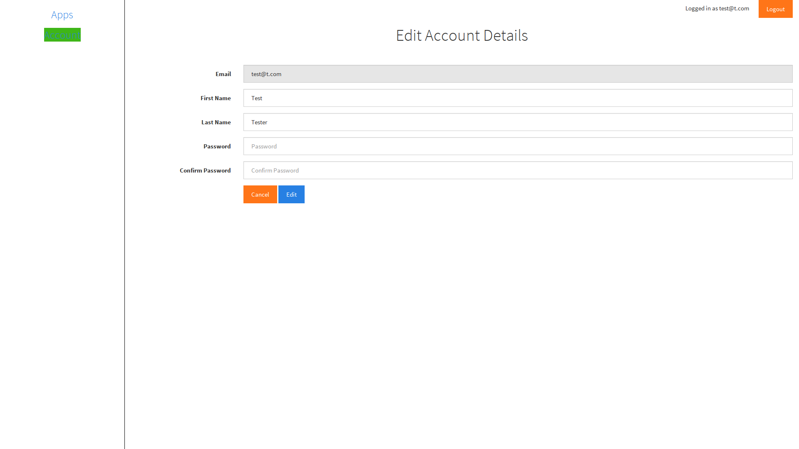

App details & edit
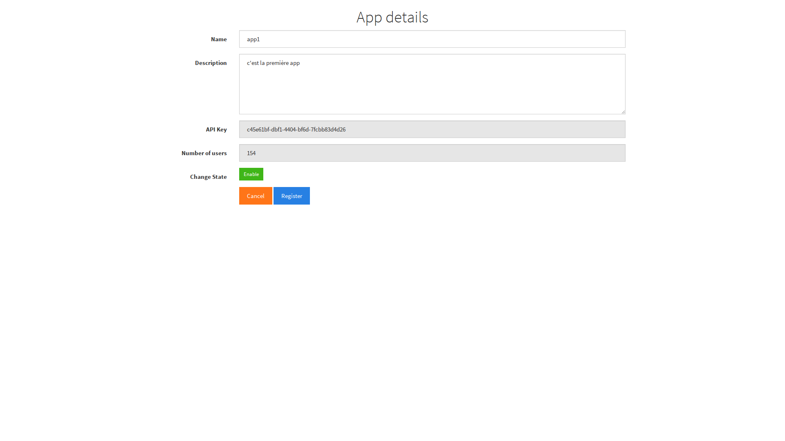

Application end users list
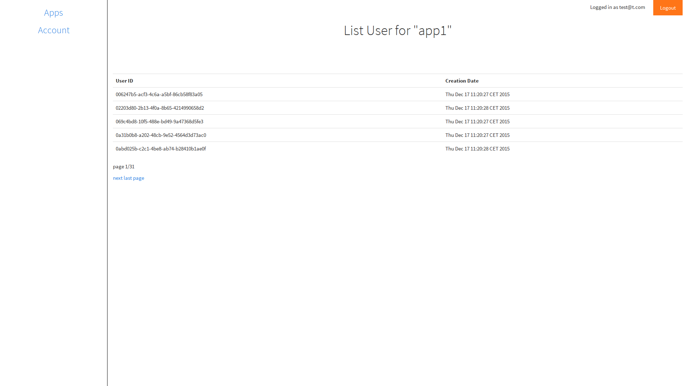

### REST API

The API documentation can be found [here](http://myproject.download/amt/apidoc/)

### Design patterns

## Implementation

### Package structure

```
amtproject
├───entities
│       AbstractEntity.java
│       Account.java
│       ApiKey.java
│       Application.java
│       Award.java
│       Badge.java
│       BadgeAward.java
│       EndUser.java
│       EventAction.java
│       EventCondition.java
│       Level.java
│       PointAward.java
│       Rule.java
│       UserRole.java
│
├───rest
│   │   PackageInfo.java
│   │
│   ├───config
│   │       ApplicationConfig.java
│   │       JacksonConfigurationProvider.java
│   │       JsonExceptionMapper.java
│   │
│   ├───dto
│   │       BadgeCreationDTO.java
│   │       BadgeDTO.java
│   │       BadgeSummaryDTO.java
│   │       EventTriggerDTO.java
│   │       LevelCreationDTO.java
│   │       LevelDTO.java
│   │       ReputationDTO.java
│   │
│   └───resources
│           BadgesResource.java
│           EventResource.java
│           LevelRessource.java
│           ReputationRessource.java
│
├───services
│   │   AppsManager.java
│   │   AppsManagerLocal.java
│   │   TestDataManager.java
│   │   TestDataManagerLocal.java
│   │
│   └───dao
│       │   ApiKeyDAO.java
│       │   ApiKeyDAOLocal.java
│       │   ApplicationDAO.java
│       │   ApplicationDAOLocal.java
│       │   EndUserDAO.java
│       │   EndUserDAOLocal.java
│       │   GenericDAO.java
│       │   IGenericDAO.java
│       │   RoleDAO.java
│       │   RoleDAOLocal.java
│       │   UserDAO.java
│       │   UserDAOLocal.java
│       │
│       └───rest
│               BadgeAwardDAO.java
│               BadgeAwardDAOLocal.java
│               BadgeDAO.java
│               BadgeDAOLocal.java
│               EventConditionDAO.java
│               EventConditionDAOLocal.java
│               LevelDAO.java
│               LevelDAOLocal.java
│               PointAwardDAO.java
│               PointAwardDAOLocal.java
│               RuleDAO.java
│               RuleDAOLocal.java
│
├───utils
│       MonitoringListener.java
│
└───web
    ├───controller
    │       AccountServlet.java
    │       AppDetailsServlet.java
    │       DashborardServlet.java
    │       HomeServlet.java
    │       ListUsersServlet.java
    │       LogoutServlet.java
    │       NewAppServlet.java
    │       RegistrationServlet.java
    │
    └───filters
            SecurityFilter.java
```

### Selected aspects
The Bootstrap libraries are used for the design of the views.

## Testing and validation

### Test strategy
### Tools
### Procedures
### Results

## Demo

### Screenshots

Home
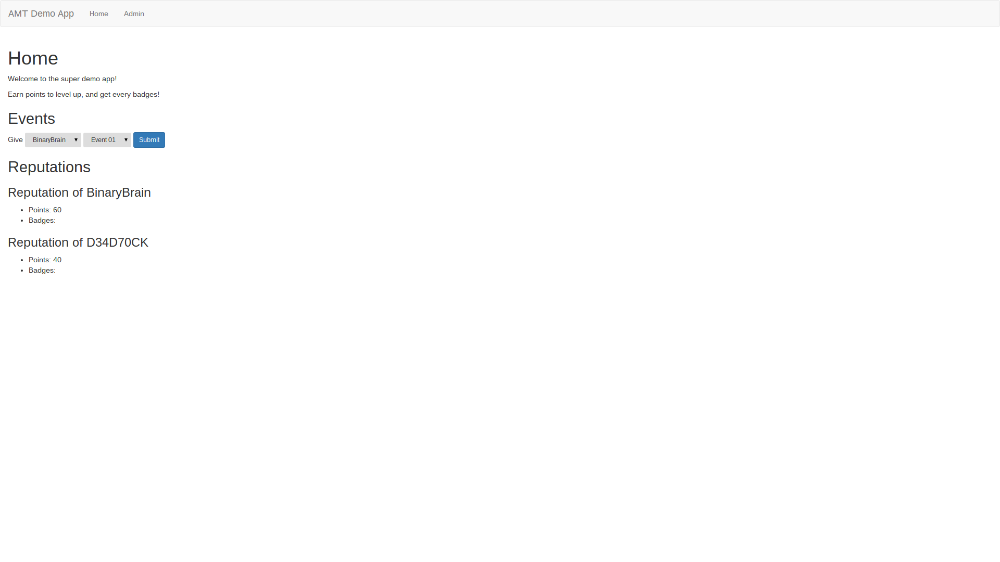

Admin
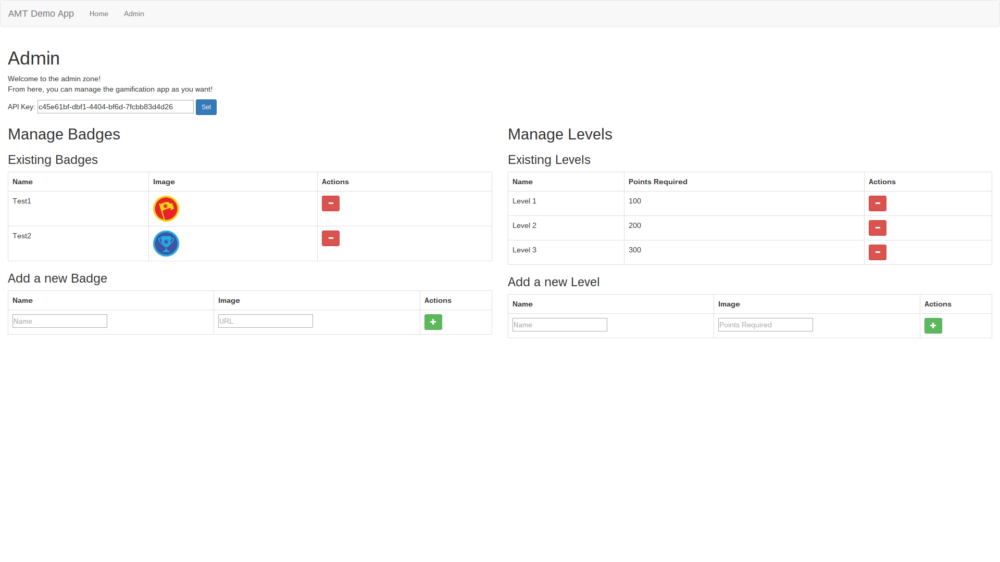

## Known Issues

- Competition not managed due a lack of time
- Errors not handled on the server side

## Conclusion


